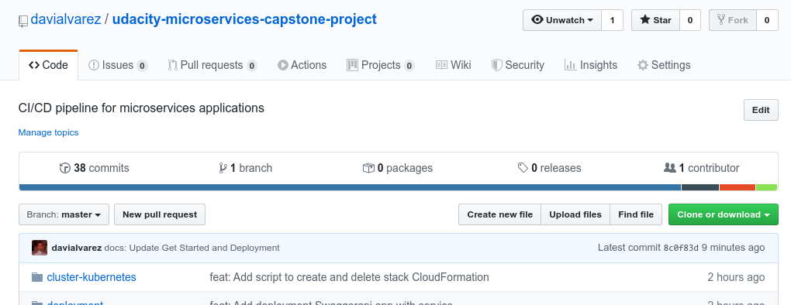
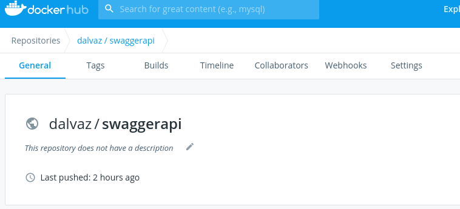
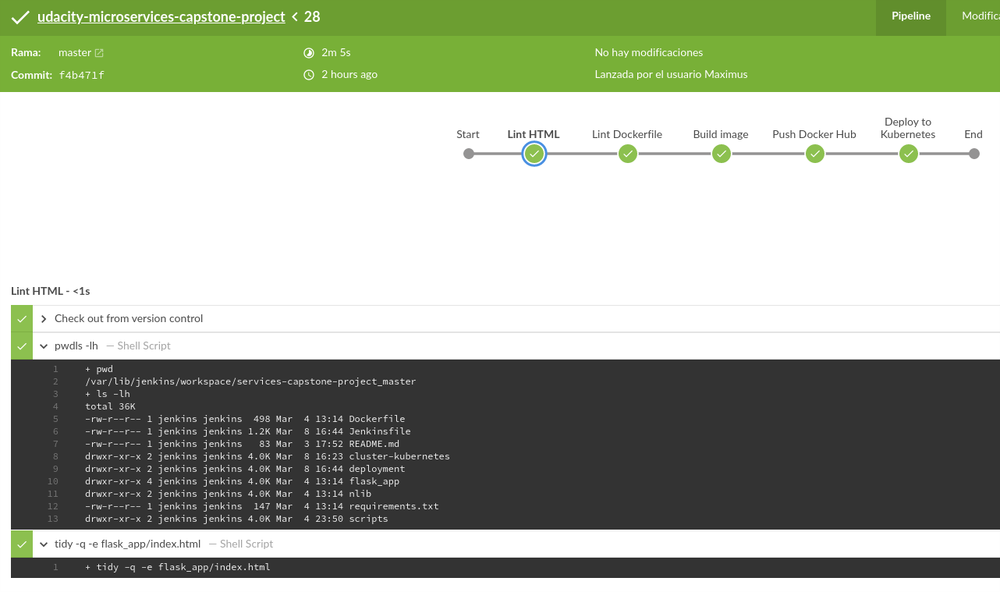
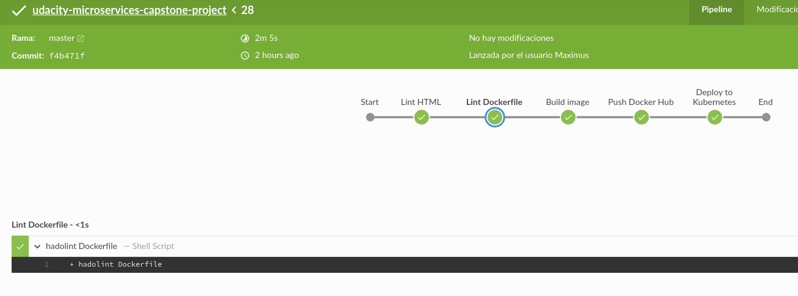
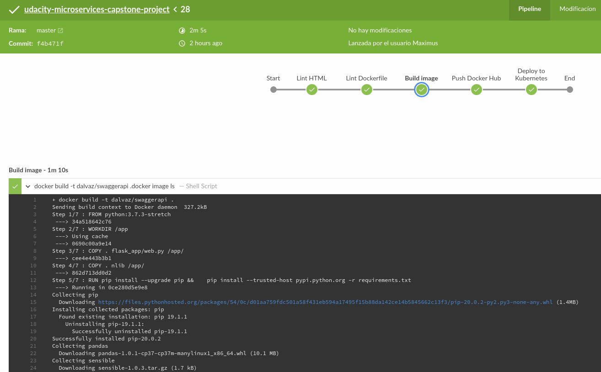
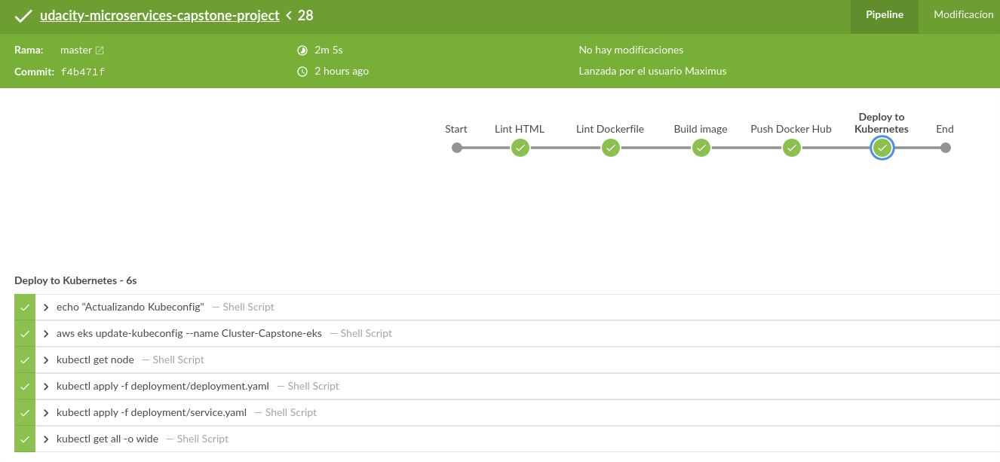
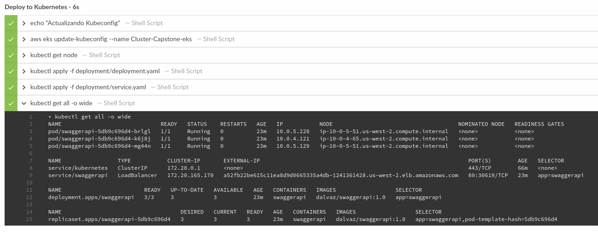
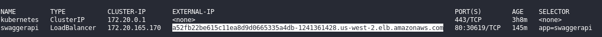
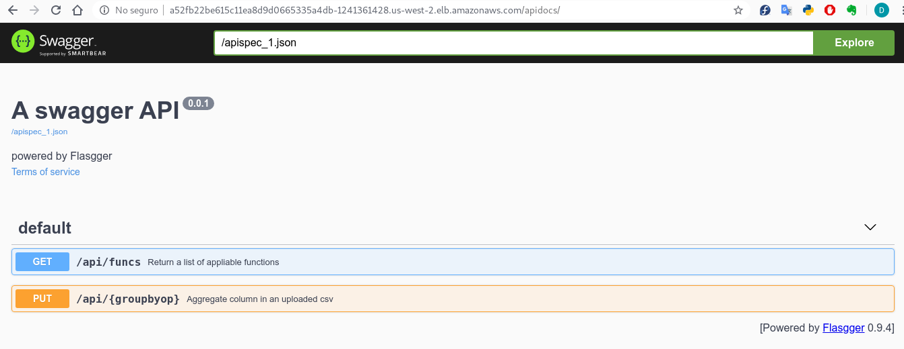

# Udacity Capstone Microservice Application 
> Swagger API applications over Kubernetes.

CI/CD pipeline for micro services applications (Swaggerapi) with rolling deployment over Kubernetes. 


## Features

In this project the following skills apply:

- Working in AWS
- Using Jenkins to implement Continuous Integration and Continous Deployment
- Building pipelines
- Working with CloudFormation to deploy clusters
- Building Kubernetes clusters
- Building Docker containers in pipelines

## Get Started

### Prerequisites

- Docker
- Kubernetes (AWS EKS)
- CloudFormation
- Jenkins
- Python
- aws-cli
- kubectl

#### Linux installation:

1. Clone repository

```sh
git clone https://github.com/davialvarez/udacity-microservices-capstone-project.git
```

1. First create Kubernetes EKS on Amazon Web Service
```sh
./create.sh Iam-Capstone cluster-kubernetes/iam.yml
./create.sh Vpc-Capstone cluster-kubernetes/vpc.yml
./create.sh Eks1-Capstone cluster-kubernetes/eks1cluster.yml
```

2. Update kubeconfig 

```sh
aws eks update-kubeconfig --name Cluster-Capstone-eks
kubectl get all -o wide
```

3. Add nodes to EKS

Before add **rolearn** from _IAM console_ to **aws-auth-cm.yaml**. Go to section IAM -> Roles -> Iam-Capstone-EksWorkerRole-XXXXXXXXXXXX and copy **"Role ARN"**.

```yml
apiVersion: v1
kind: ConfigMap
metadata:
  name: aws-auth
  namespace: kube-system
data:
  mapRoles: |
    - rolearn: [add ARN here and the save file]
      username: system:node:{{EC2PrivateDNSName}}
      groups:
        - system:bootstrappers
        - system:nodes
```

Apply config.

```sh
kubectl apply -f cluster-kubernetes/aws-auth-cm.yaml
```

## Deployment App

This app enabled a rolling update deployment. 

1. Deploy image, replicas and rollingUpdate

```sh
kubectl apply -f deployment/deployment.yaml
```

2. Create service

```sh
kubectl apply -f deployment/service.yaml
```

## Screenshot Project Specification (Rubric)

### Set Up Pipeline

1. Create Github repository with project code



2. Use image repository to store Docker images



### Build Docker Container

1. Execute linting step in code pipeline 





2. Build a Docker container in a pipeline



### Succesful Deployment

1. The Docker container is deployed to a Kubernetes cluster



2. Use Rolling Deployment successfully







## Meta

David Alvarez – davi.alvarez@protonmail.com

[https://github.com/davialvarez/udacity-microservices-capstone-project](https://github.com/davialvarez/udacity-microservices-capstone-project)

## Contributing

1. Fork it (<https://github.com/davialvarez/udacity-microservices-capstone-project/fork>)
2. Create your feature branch (`git checkout -b feature/fooBar`)
3. Commit your changes (`git commit -am 'Add some fooBar'`)
4. Push to the branch (`git push origin feature/fooBar`)
5. Create a new Pull Request

<!-- Markdown link & img dfn's -->
[npm-image]: https://img.shields.io/npm/v/datadog-metrics.svg?style=flat-square
[npm-url]: https://npmjs.org/package/datadog-metrics
[npm-downloads]: https://img.shields.io/npm/dm/datadog-metrics.svg?style=flat-square
[travis-image]: https://img.shields.io/travis/dbader/node-datadog-metrics/master.svg?style=flat-square
[travis-url]: https://travis-ci.org/dbader/node-datadog-metrics
[wiki]: https://github.com/yourname/yourproject/wiki
